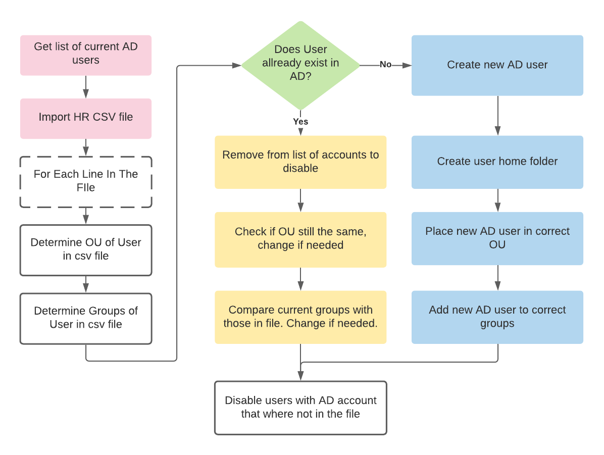

# PS-AD-Account-Updater
A script to update AD accounts (OU, groups) or create new AD accounts (account, home folder, add to groups, OU) from a csv file.

You can find two example csv files for testing (files created by Tom Cordemans for the Windows 2 curriculum at Vives University College, Bruges).

## FLowchart

